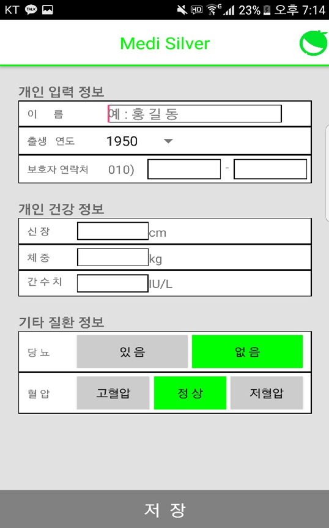
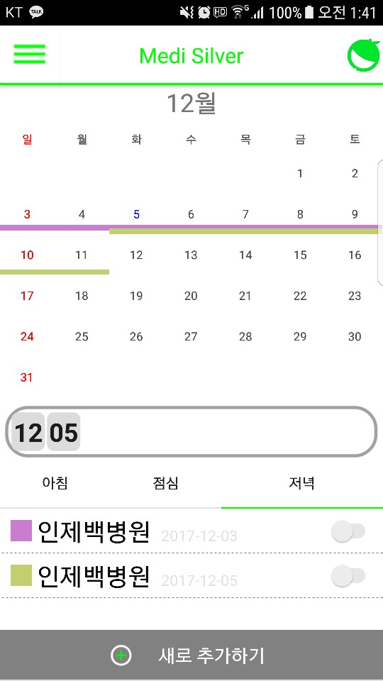
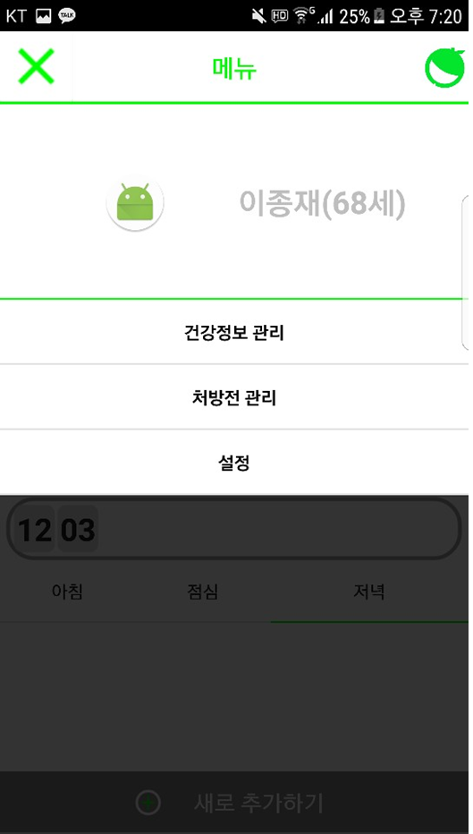
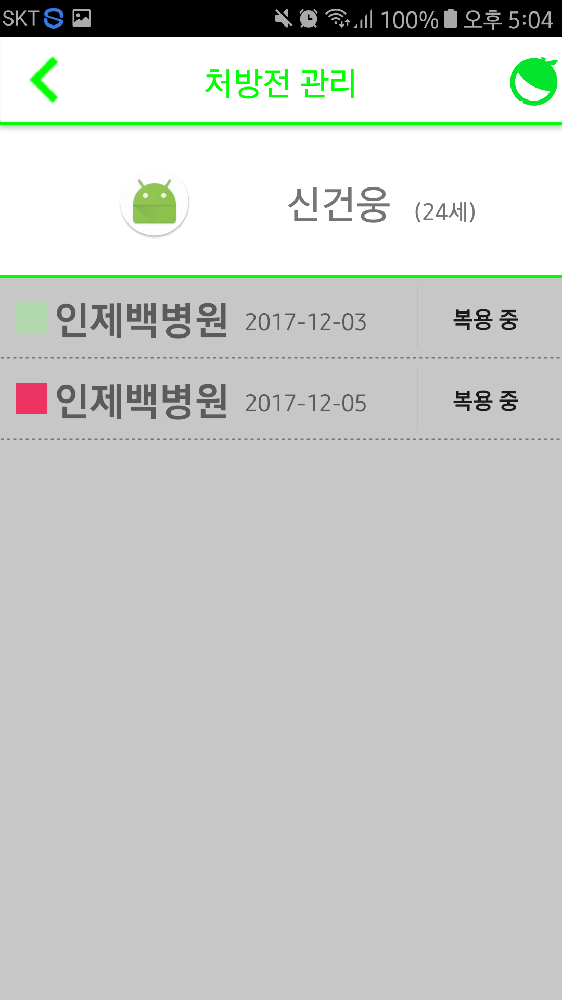
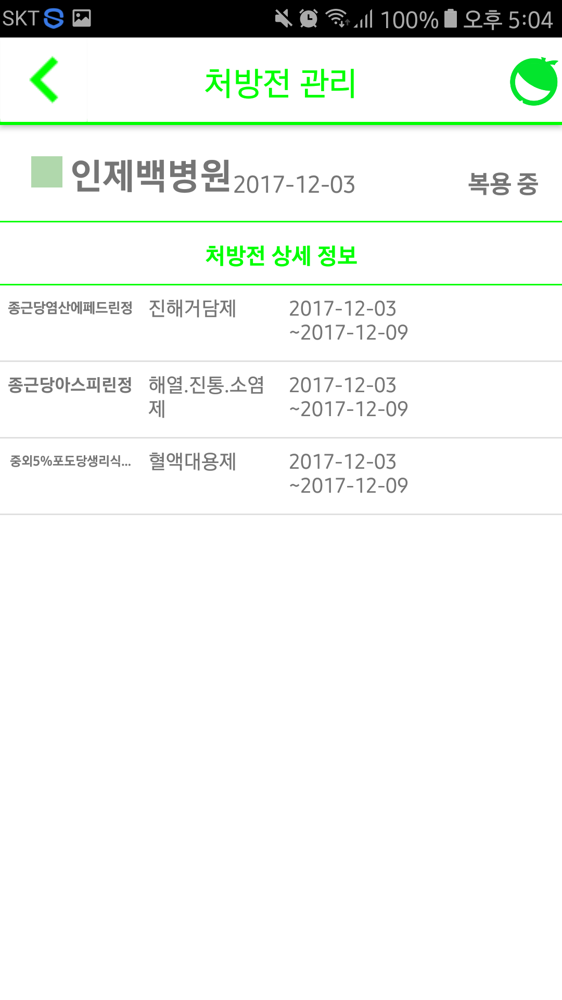
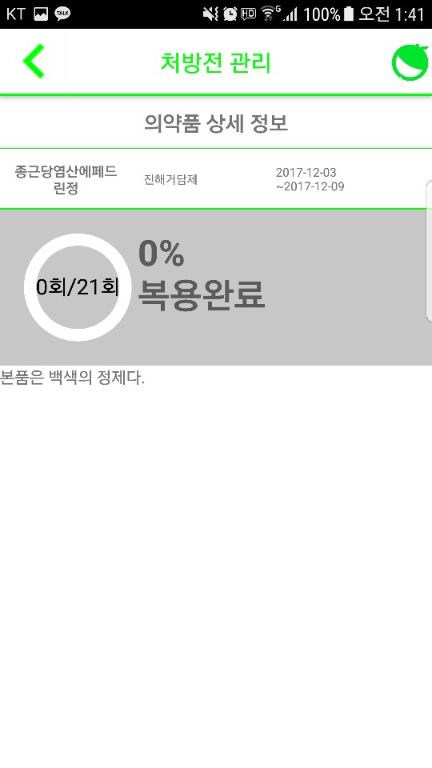

# medisilver
University Graduation Work 

  

> 🏫University : Inje  
> 🛠 Team : Geonwoong.Shin, Youngjin.Park, Jongjae.Lee, Taehyeon.Ryu(ryu-coding)  
> 🗓 Develop Date : 2017.10 ~ 2018.05  

## 🎯 Purpose
* App for adults (50s to 60s) who frequently visit hospitals.
* At the time (2017), the shortcomings of commercially released applications were improved and a convenient UI was provided.
* <b>Prescription management app using prescription QR code</b>

## 🚀Usage

   
  
  
  
  
  

## Author

🙋‍♂️ ryu-coding (TaeHyeon.Ryu)

- Personal Mail : ryu.coding1@gmail.com

## 📝 License
* This project is Free licensed.
* You can use and refer to it.
* Currently, no further development is underway.
